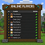

# Online Board BP

A Minecraft Bedrock Behavior Pack that displays an online player board using Script API.

## Features

- Online player list
- World day
- Minecraft time
- Lightweight
- Script API

## Requirements

- Minecraft Bedrock 1.21.90+
- Experimental APIs enabled

## Installation

Download the latest `.mcpack` from Releases and open it with Minecraft.

## Screenshots

## License

MIT
